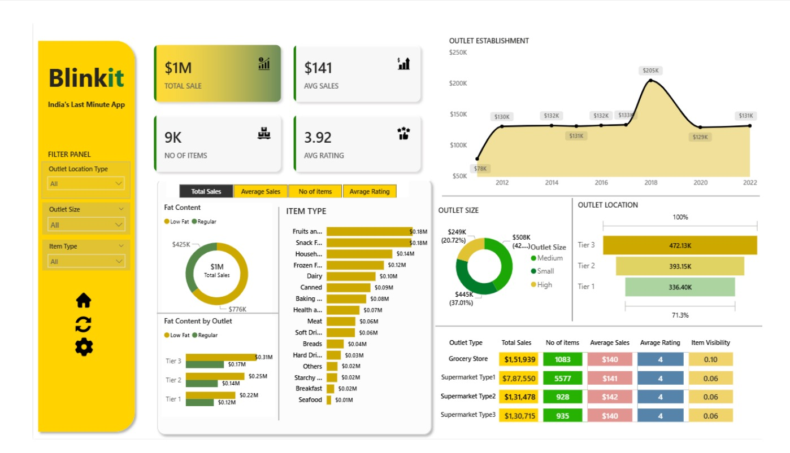

# 🛒 Blinkit Sales Dashboard - Power BI Project

This project is a comprehensive Power BI dashboard built to analyze Blinkit's sales performance, customer satisfaction, and inventory distribution. It focuses on identifying key insights and opportunities for business optimization using well-defined KPIs and interactive visualizations.

## 📌 Objective

To conduct a detailed analysis of Blinkit’s operations using sales data. The dashboard enables stakeholders to track performance metrics, assess customer satisfaction, and make data-driven decisions for improved operational efficiency.

---

## 📊 Dashboard Overview

The Power BI dashboard includes multiple interactive visuals and KPI cards to provide a holistic view of the business. It features:

- ✅ **Total Sales**: The overall revenue generated.
- 📈 **Average Sales**: Revenue per individual sale.
- 📦 **Number of Items**: Count of unique products sold.
- ⭐ **Average Rating**: Customer satisfaction levels.
- 📅 **Date-wise Trends**: Sales patterns over time.
- 📍 **City & Region-wise Analysis**: Performance across locations.
- 🔍 **Category & Sub-category Sales**: Top-performing items.

---

## 🧠 Key Business Insights

1. **Top Cities** by revenue help prioritize logistics and inventory.
2. **Best-selling Categories** drive marketing decisions.
3. **Customer Rating Trends** indicate satisfaction over time.
4. **Average Sales Dip** can highlight slow-moving periods or underperformance.

---

## 📜 Storytelling Approach

This dashboard is structured to guide stakeholders through:

- **What is happening** (Total/Avg sales metrics)
- **Where it is happening** (Location & category-wise insights)
- **Why it is happening** (Trends and ratings)
- **What to do next** (Optimize inventory & improve weak spots)

## 📝 Business Requirement Summary

To conduct a comprehensive analysis of Blinkit's sales performance, customer satisfaction, and inventory distribution to identify key insights and opportunities for optimization using various KPIs and visualizations in Power BI.

### KPI Requirements:

1. **Total Sales** - Total revenue from all items sold.  
2. **Average Sales** - Average revenue per sale.  
3. **Number of Items** - Total count of different items sold.  
4. **Average Rating** - Average customer rating of items

## 📂 Files Included

- `Blinkit Analysis Dashboard.pbit` – Power BI dashboard template.
- `Blinkit_Sales_Analysis_Dashboard.ppt` – Contain the Summary of the Dashboard.
- 'BlinkIT Grocery Data Excel.xlsx' - Dataset used for Power BI Dashboard.

---

## ⚒️ How to Use the Template

1. Download `Blinkit_Analysis_Dashboard.pbit`
2. Open with **Power BI Desktop**
3. Load your dataset 
4. Refresh and explore KPIs
5. Customize or extend based on your needs

## 🎯 Real-World Use Cases

- Inventory & supply chain optimization  
- Customer satisfaction tracking  
- Product category performance analysis  
- Sales forecasting & promotional planning 

---

## 📬 Contact

📧 Email ID - sirishadsirishad6@gmail.com
💼 Linkdlen -https://www.linkedin.com/in/sirisha-d-064b69278/

---

